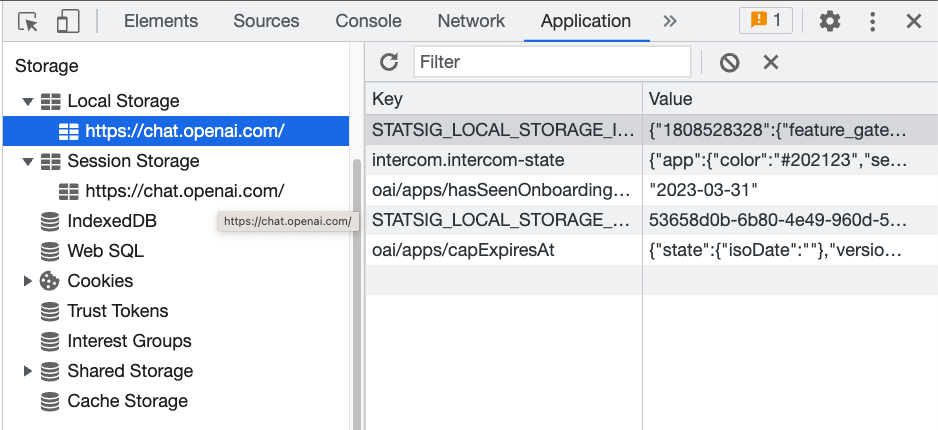
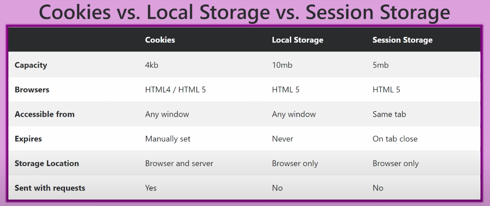

# Web Storage

Web storage is a feature in modern web browsers that allows web applications to store data in the user's web browser. This is due to the interface of the `Storage API` that expose the `Local` and `Session Storage`.
[Ref. Web Storage](https://developer.mozilla.org/es/docs/Web/API/Storage)



### **Local Storage**

Local Storage is a type of web storage that allows web applications to **store data with no expiration date**. The data stored in Local Storage will persist even after the browser window is closed or the computer is restarted.

To store data in Local Storage, you can use the localStorage object in JavaScript. Here is an example:

```
localStorage.setItem('key', 'value');
const value = localStorage.getItem('key');
```

[Ref. Local Storage](https://developer.mozilla.org/es/docs/Web/API/Window/localStorage)

---

### **Session Storage**

Session Storage is another type of web storage that allows web applications to **store data for the duration of a session**. A session lasts as long as the user's browser is open and the web application is running. Once the user closes the browser or navigates away from the page, the session ends and the data is deleted.

To store data in Session Storage, you can use the sessionStorage object in JavaScript. Here is an example:

```
sessionStorage.setItem('key', 'value');
const value = sessionStorage.getItem('key');
```

[Ref. Session Storage](https://developer.mozilla.org/es/docs/Web/API/Window/sessionStorage)

---

### **Cookies**

Cookies are information constantly shared by the server and the browser trough every request until an expirtation date, so the server keeps track of the client activity.

To store data in a cookie, you can use the document object in JavaScript. Here is an example:

```
document.cookie = "name=value; expires=2023-07-01T05:00:00.000Z";
const value = document.cookie;
```

**See that the expiration date must be in a UTC format**

[Ref. Cookies](https://developer.mozilla.org/es/docs/Web/HTTP/Cookies)

---

### **Differences**



- Local Storage and Cookies data is available across all browser windows and tabs, while Session Storage data is only available within the current session and current tab.

- Data stored in local storage has no expiration date, meaning it will persist even after the user closes their browser and reopens it at a later time. While Session Storage is only available for the duration of the user's session, meaning that it will be cleared when the user closes their browser. But Cookies while remain until their expiration date, which is set by the server or user.

- Local Storage has the largest storage capacity. Cookies has the minimum since we should avoid sending unnecessary data to the server.

---

### **Common use cases**

#### Local Storage:

- Storing user preferences or settings that need to persist across sessions
- Storing data that needs to be shared between different parts of a website, such as a shopping cart or a user's browsing history
- Caching data to improve website performance, such as images or other resources that don't change frequently

#### Session Storage:

- Storing temporary data that only needs to be available for the duration of a user's session, such as form data or temporary authentication tokens.

#### Cookies:

- Storing session Ids so the authentication process is faster.
- Storing user's profile relevant data for the server.
- Keep track of the user's interaction routines.
